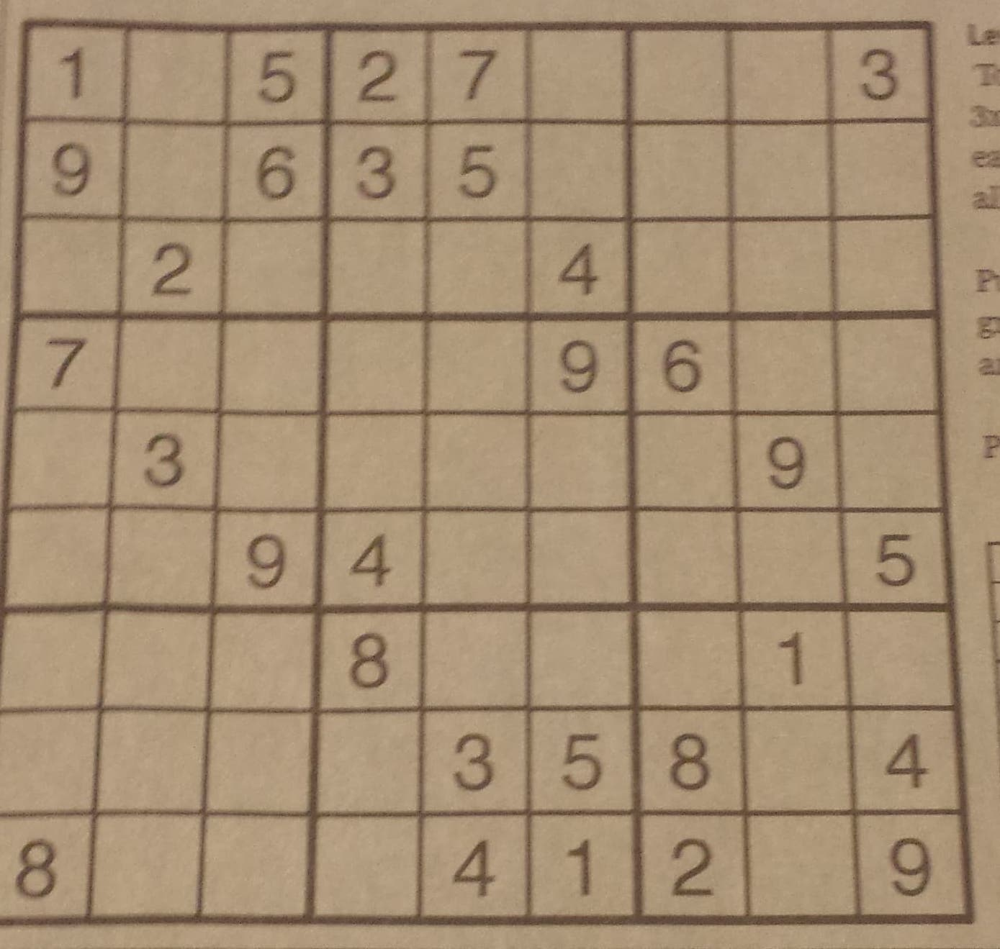
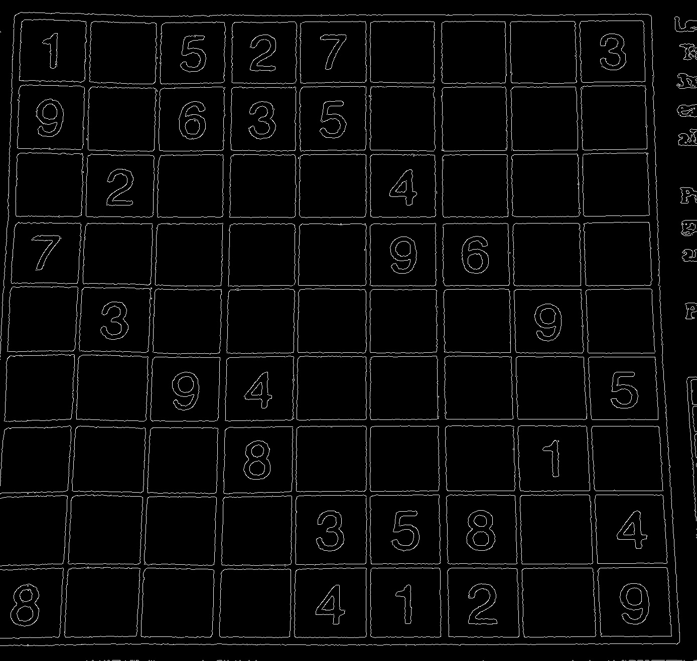
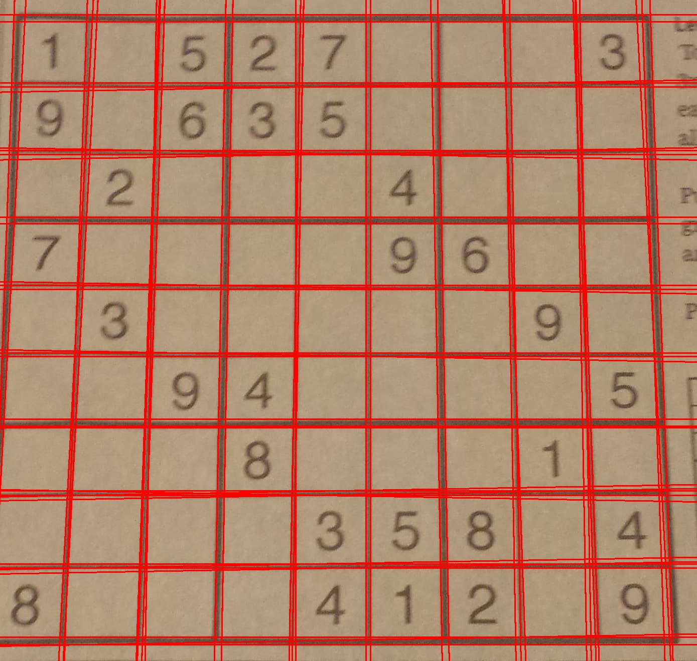
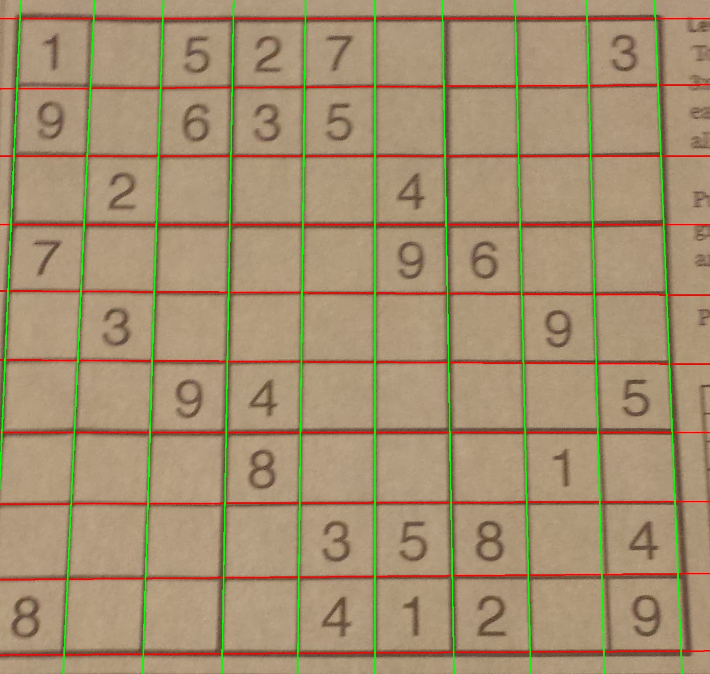

# SudokuSolver
This is a work in progress project where the final goal is a program that uses Machine Learning based Computer Vision techniques to read a sudoku in an
image and the GAC algorithm to solve the puzzle.

At the moment the use is not very user friendly. You would have to modify the code in \__main__ by supplying the path to the image you are using. After doing that simply run `python box_detection.py`. Currently the dependencies are numpy, sklearn and openCV. As these dependencies grow I will update them here.

# So, how does it work?
It starts by taking an image of a sudoku like the following,

Then, using openCV the image is converted to gray scale, thresholded to black and white and the Canny edge detector is applied resulting in the following image.

Then the Hough transform is used, resulting in the following lines.

KMeans is then used in the rho-theta space with 20 clusters. The resultant cluster centers approximate the grid lines quite well. Then KMeans is used once again to cluster the vertical and horizontal lines into separate groups. The theta value is used to map the angle to a coordinate on the unit circle and KMeans uses those coordinates. This can be seen in the following image.

# Next Steps
The next steps include, solving for the intersection points and extracting the digits, using a neural net training on MNIST to recognize the digits and lastly implementing GAC to solve the sudoku puzzle as a CSP.
